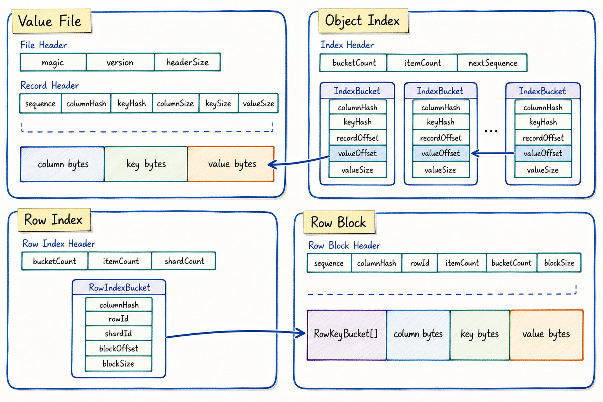

# LumoDB


LumoDB is a small C++20 embedded database for fast point reads of serialized
objects. It stores values as opaque bytes, so FlatBuffers, Protobuf, or custom
binary payloads can be written and read back without coupling the database layer
to a serializer.

```text
Column + Key          -> mmap hash index -> append-only value offset
Column + RowId + Key  -> row index       -> row block local key index
```

## Highlights

- O(1)-style point lookup through memory-mapped open-addressing indexes.
- Append-only value files for simple sequential writes.
- `Column + Key` addressing for independent object categories.
- `Column + RowId + Key` addressing for row-partitioned object maps.
- Row blocks with local key indexes for efficient row-level grouping.
- Mutex-free row write hot path for distinct row ids in a preallocated row index.
- Index rebuild by scanning append-only value files.

LumoDB intentionally does not implement SQL, range scans, deletion,
transactions, or compaction. It is focused on exact-key whole-object readback.

## Storage Format



The format is split into four structures:

- `Value File`: append-only records for the simple object path.
- `Object Index`: mmap hash buckets pointing into `values.lumov`.
- `Row Index`: mmap hash buckets mapping `(column, rowId)` to a row block.
- `Row Block`: one row-local key index plus packed key/value byte regions.

## Quick Start

```bash
cmake -S . -B build -DCMAKE_BUILD_TYPE=Release
cmake --build build -j
ctest --test-dir build --output-on-failure
```

```cpp
#include "lumodb/database.h"

#include <string>

int main() {
  LumoDB::Database db;
  LumoDB::Status status = db.Open("/tmp/example-lumodb");
  if (!status) {
    return 1;
  }

  db.Put("hello", "world");

  std::string value;
  db.Get("hello", value);

  db.Close();
  return 0;
}
```

## Storage Model

Object storage writes one append-only record per `(column, key)` and updates the
mmap object index:

```text
PutStruct(column, key, bytes)
  -> values.lumov append record
  -> index.lumoi maps column/key to offset/size
```

Row storage groups many keyed objects into one row block. Each row block has a
local key index, then gets appended to one value shard:

```text
PutRowStructs(column, rowId, entries)
  -> build one row block with local key index
  -> append to row_values-NNN.lumorv
  -> row_index.lumori maps column/rowId to shard/offset/size
```

Concurrent `PutRowStructs` calls for the same column and different `rowId`
values reserve append offsets with atomics, write disjoint file ranges with
`pwrite`, and publish row index buckets with atomic compare/exchange. Size
`initialRowBucketCount` for the expected number of rows; live row writes return
`InvalidArgument` instead of resizing the mmap row index on the write path.

Reads are direct point reads. The caller is expected to know `column`, `rowId`,
and `key`; LumoDB does not scan rows to discover objects.

## Files

Default row storage with `rowShardCount = 8` creates:

```text
database-directory/
├── values.lumov
├── index.lumoi
├── row_index.lumori
├── row_values-000.lumorv
├── row_values-001.lumorv
├── row_values-002.lumorv
├── row_values-003.lumorv
├── row_values-004.lumorv
├── row_values-005.lumorv
├── row_values-006.lumorv
└── row_values-007.lumorv
```

If an index file is missing or invalid, LumoDB rebuilds it by scanning the
corresponding append-only value files.

## API

### Object API

```cpp
LumoDB::Database db;
db.Open("/tmp/lumodb");

std::vector<std::byte> bytes = BuildStructA();
db.PutStruct("StructA", "object-key", bytes);

std::vector<std::byte> loaded;
db.GetStruct("StructA", "object-key", loaded);
```

### Row API

```cpp
LumoDB::DatabaseOptions options;
options.initialRowBucketCount = 1ULL << 20;
options.rowShardCount = 8;

LumoDB::Database db;
db.Open("/tmp/lumodb", options);

std::vector<std::byte> objectA = BuildStructA();
std::vector<std::byte> objectB = BuildStructA();
std::vector<LumoDB::RowStructEntry> entries = {
    {.key = "object-a", .flatBufferBytes = objectA},
    {.key = "object-b", .flatBufferBytes = objectB},
};

db.PutRowStructs("StructA", 42, entries);

std::vector<std::byte> loaded;
db.GetRowStruct("StructA", 42, "object-a", loaded);
```

## FlatBuffers

The example schema is in `schemas/example.fbs`.

```bash
flatc --cpp -o generated schemas/example.fbs
```

LumoDB itself has no FlatBuffers runtime dependency.

## Tests

LumoDB uses GoogleTest. CMake searches for a local GTest installation and falls
back to FetchContent when needed.

```bash
ctest --test-dir build --output-on-failure
```

The default test suite includes focused unit tests plus system tests:

- `lumodb_tests`: KV put/get, struct byte payloads, row block lookup, object
  index rebuild, row index rebuild, and concurrent independent row writes under
  the same column.
- `lumodb_system_tests`: end-to-end object write/read, row write/read,
  reopen/readback, same-column parallel row writes, and parallel row reads.

Run only the system tests when validating the advertised read/write behavior:

```bash
ctest --test-dir build -R LumoDBSystemTest --output-on-failure
```

## Benchmark

Object benchmark:

```bash
./build/lumodb_bench --dir /tmp/lumodb-bench --sizes 1,5,10 --read-count 100
```

Parallel row benchmark:

```bash
./build/lumodb_bench --mode row-parallel --dir /tmp/lumodb-bench \
  --sizes 1,5,10 --read-count 100 --row-entries 64 --threads 8 --shards 8
```

Recent local result on an 8-core machine, using 4 KiB payloads and 100 random
reads:

| Mode | Size | Objects | Rows | Write Time | Throughput |
|---|---:|---:|---:|---:|---:|
| row-parallel | 1GB | 262,144 | 4,096 | 0.654s | 1566.91 MB/s |
| row-parallel | 5GB | 1,310,720 | 20,480 | 3.281s | 1560.63 MB/s |
| row-parallel | 10GB | 2,621,440 | 40,960 | 6.465s | 1584.01 MB/s |

## Project Layout

```text
.
├── CMakeLists.txt
├── README.md
├── bench/
│   └── benchmark.cpp
├── docs/
│   └── assets/
│       └── lumodb-storage-format.png
├── schemas/
│   └── example.fbs
├── src/
│   └── lumodb/
│       ├── database.cpp
│       ├── database.h
│       ├── file.cpp
│       ├── file.h
│       ├── hash.cpp
│       ├── hash.h
│       ├── status.h
│       └── storage_format.h
└── tests/
    ├── kv_test.cpp
    ├── parallel_row_test.cpp
    ├── rebuild_test.cpp
    ├── row_storage_test.cpp
    ├── struct_test.cpp
    ├── system_test.cpp
    └── test_utils.h
```
