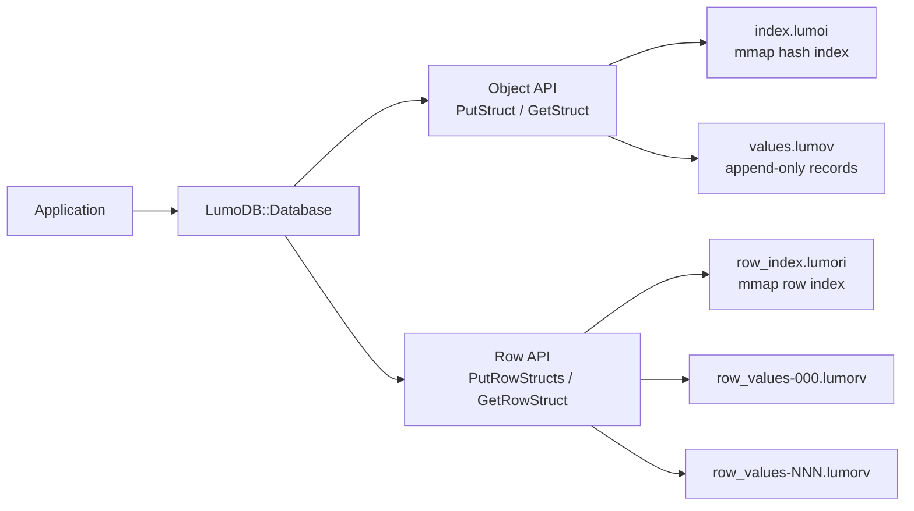
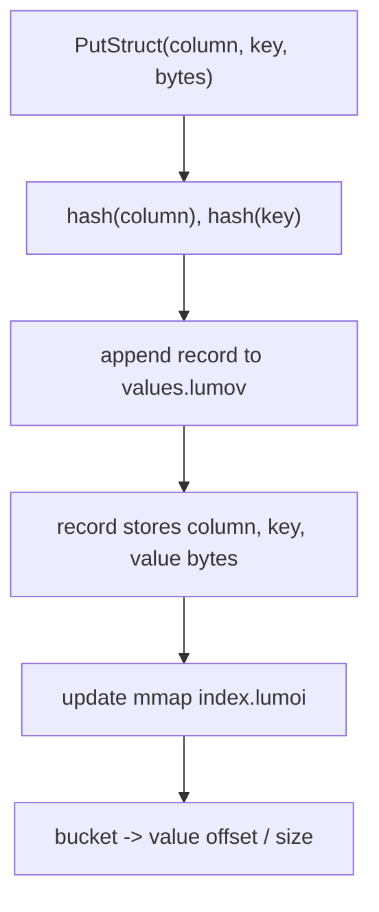
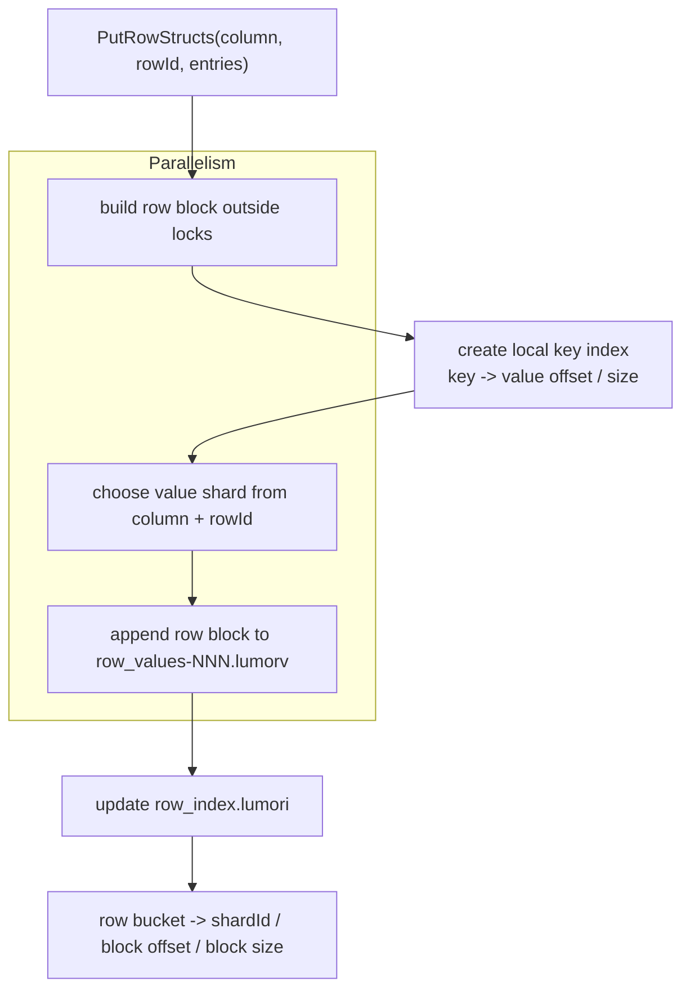
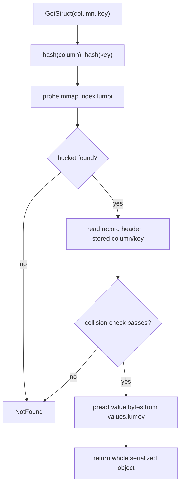
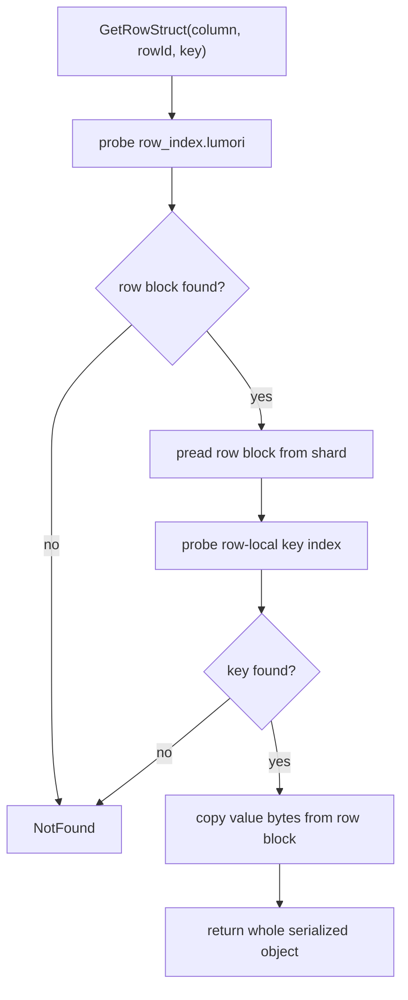
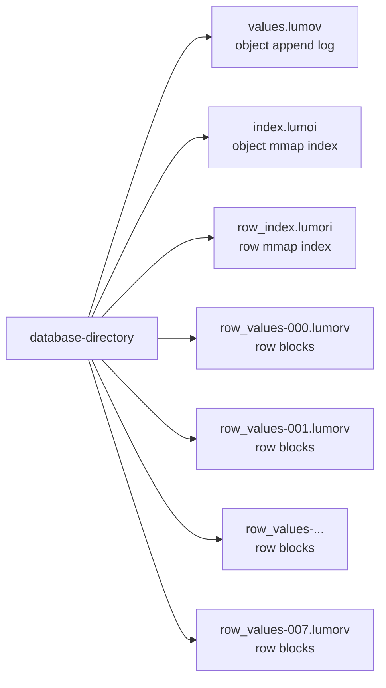

# LumoDB


LumoDB is a small C++20 embedded database for fast point reads of serialized
objects. It keeps the storage layer deliberately simple:

```text
Column + Key          -> mmap hash index -> append-only value offset
Column + RowId + Key  -> row index       -> row block local key index
```

Values are opaque bytes. FlatBuffers work well with this model, but LumoDB does
not depend on FlatBuffers at runtime. Callers own serialization; LumoDB owns
offset indexing, append-only persistence, and whole-object readback.

## Contents

- [Why LumoDB](#why-lumodb)
- [Quick Start](#quick-start)
- [Architecture](#architecture)
- [Write Path](#write-path)
- [Read Path](#read-path)
- [File Layout](#file-layout)
- [API](#api)
- [Testing](#testing)
- [Benchmark](#benchmark)
- [Project Layout](#project-layout)

## Why LumoDB

LumoDB is built for workloads where the caller already knows the exact object
address and wants the whole serialized object back quickly.

- O(1)-style point lookup through memory-mapped open-addressing indexes.
- Append-only value files for simple sequential writes.
- `Column + Key` addressing for independent struct categories.
- `Column + RowId + Key` addressing for row-partitioned struct maps.
- Row blocks with local key indexes for efficient row-level grouping.
- Parallel row writes through fixed value shards.
- Index rebuild by scanning append-only value files.
- Collision safety by validating stored column/key bytes before returning data.

LumoDB intentionally does not implement SQL, range scans, deletion, transactions,
or compaction. The current scope is focused: write serialized objects, lookup by
an exact key, and read the whole object back.

## Quick Start

```bash
cmake -S . -B build -DCMAKE_BUILD_TYPE=Release
cmake --build build -j
ctest --test-dir build --output-on-failure
```

Minimal usage:

```cpp
#include "lumodb/database.h"

#include <cstddef>
#include <string>
#include <vector>

int main() {
  LumoDB::Database db;
  LumoDB::Status status = db.Open("/tmp/example-lumodb");
  if (!status) {
    return 1;
  }

  db.Put("hello", "world");

  std::string value;
  db.Get("hello", value);

  db.Close();
  return 0;
}
```

## Architecture



Two storage paths are available:

- Object storage: one object per `(column, key)` pair.
- Row storage: one row block per `(column, rowId)`, with a local key index inside
  that row block.

## Write Path

### Object Write



Object writes are append-only. Rewriting the same `(column, key)` leaves the old
record in the value file and updates the index bucket to the newest offset.

### Parallel Row Write



Rows are independent. Multiple threads can prepare row blocks in parallel and
append them to different shard files. The row index remains small and maps
`(column, rowId)` to the row block location.

## Read Path

### Object Read



### Row Read



The caller is expected to know `column`, `rowId`, and `key`. LumoDB does not
scan rows to discover objects.

## File Layout

Default row storage with `rowShardCount = 8` creates one row index file and
eight row value shard files.

```text
database-directory/
├── values.lumov
├── index.lumoi
├── row_index.lumori
├── row_values-000.lumorv
├── row_values-001.lumorv
├── row_values-002.lumorv
├── row_values-003.lumorv
├── row_values-004.lumorv
├── row_values-005.lumorv
├── row_values-006.lumorv
└── row_values-007.lumorv
```



If `index.lumoi` is missing or has an invalid header, LumoDB rebuilds it by
scanning `values.lumov`. Row storage follows the same rule: if `row_index.lumori`
is missing or invalid, LumoDB rebuilds it by scanning `row_values-*.lumorv`.

## API

### Object API

```cpp
LumoDB::Database db;
db.Open("/tmp/lumodb");

std::vector<std::byte> bytes = BuildStructA();
db.PutStruct("StructA", "object-key", bytes);

std::vector<std::byte> loaded;
db.GetStruct("StructA", "object-key", loaded);

db.Close();
```

### Row API

```cpp
LumoDB::DatabaseOptions options;
options.rowShardCount = 8;

LumoDB::Database db;
db.Open("/tmp/lumodb", options);

std::vector<std::byte> objectA = BuildStructA();
std::vector<std::byte> objectB = BuildStructA();
std::vector<LumoDB::RowStructEntry> entries = {
    {.key = "object-a", .flatBufferBytes = objectA},
    {.key = "object-b", .flatBufferBytes = objectB},
};

db.PutRowStructs("StructA", 42, entries);

std::vector<std::byte> loaded;
db.GetRowStruct("StructA", 42, "object-a", loaded);
```

## FlatBuffers

The example schema is in `schemas/example.fbs`:

```flatbuffers
table MapA {
  key:int;
  value:string;
}

table StructA {
  mapA:[MapA];
  mapB:[MapA];
  used:bool;
}

table StructB {
  sA:[StructA];
  sB:[StructA];
}
```

Generate code with a local FlatBuffers compiler when needed:

```bash
flatc --cpp -o generated schemas/example.fbs
```

## Testing

LumoDB uses GoogleTest. CMake first searches the local system and falls back to
FetchContent when GTest is not installed.

```bash
ctest --test-dir build --output-on-failure
```

Current unit coverage:

- string KV put/get and overwrite behavior
- opaque struct bytes by column/key
- row block put/get and row-local key lookup
- object index rebuild from `values.lumov`
- row index rebuild from `row_values-*.lumorv`
- concurrent writes of independent rows

## Benchmark

Object benchmark:

```bash
./build/lumodb_bench --dir /tmp/lumodb-bench --sizes 1,5,10 --read-count 100
```

Parallel row benchmark:

```bash
./build/lumodb_bench --mode row-parallel --dir /tmp/lumodb-bench \
  --sizes 1,5,10 --read-count 100 --row-entries 64 --threads 8 --shards 8
```

Quick smoke run:

```bash
./build/lumodb_bench --mode row-parallel --sizes 0.001 --read-count 10
```

Recent local result on an 8-core machine, using 4 KiB payloads and 100 random
reads:

| Mode | Size | Objects | Rows | Write Time | Throughput |
|---|---:|---:|---:|---:|---:|
| row-parallel | 1GB | 262,144 | 4,096 | 0.654s | 1566.91 MB/s |
| row-parallel | 5GB | 1,310,720 | 20,480 | 3.281s | 1560.63 MB/s |
| row-parallel | 10GB | 2,621,440 | 40,960 | 6.465s | 1584.01 MB/s |

## Project Layout

```text
.
├── CMakeLists.txt
├── README.md
├── bench/
│   └── benchmark.cpp
├── schemas/
│   └── example.fbs
├── src/
│   └── lumodb/
│       ├── database.cpp
│       ├── database.h
│       ├── file.cpp
│       ├── file.h
│       ├── hash.cpp
│       ├── hash.h
│       ├── status.h
│       └── storage_format.h
└── tests/
    ├── kv_test.cpp
    ├── parallel_row_test.cpp
    ├── rebuild_test.cpp
    ├── row_storage_test.cpp
    ├── struct_test.cpp
    └── test_utils.h
```
